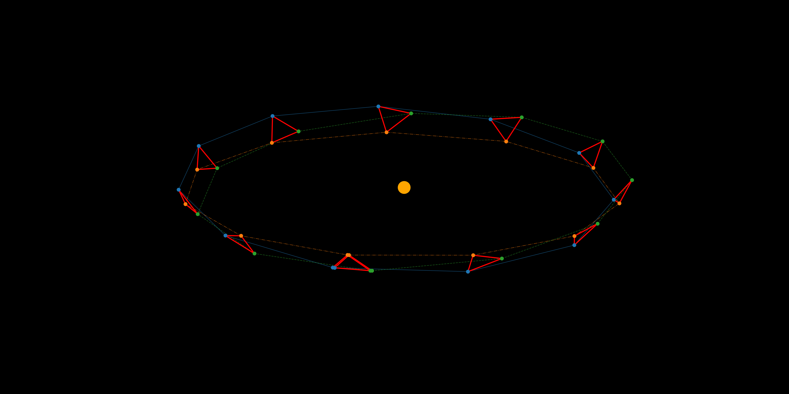

# ResponseRequirements
## Overview
This repository contains codes for studying the impact of spacecraft orbital uncertainty on LISA TDI outputs.



## Installation
Follow these steps to set up the project on your local machine:

1. **Clone the repository**:
    ```bash
    git clone https://github.com/lorenzsp/ResponseRequirements.git
    cd ResponseRequirements
    ```

2. **Install dependencies**:
    Ensure you have conda installed. Then run:
    ```bash
    conda create -n lisa_resp_env -c conda-forge gcc_linux-64 gxx_linux-64 numpy Cython scipy jupyter ipython h5py matplotlib python=3.12
    conda activate lisa_resp_env
    ```
    
    If you want to install on GPUs, add the location to the CUDA compiler `nvcc` and install cupy:
    ```bash
    export PATH=$PATH:/usr/local/cuda-12.5/
    bin/pip install cupy-cuda12x
    ```
    
    Then run:
    ```bash
    git clone https://github.com/mikekatz04/lisa-on-gpu.git
    cd lisa-on-gpu
    python setup.py install
    pip install lisaorbits lisaanalysistools
    ```

## Usage
Execute the following command to create an orbit file:
```bash
python create_orbits.py
```

Run the assessment
```bash
python assess_impact.py
```

## Contributing
Contributions are welcome! Please follow these steps:
1. Fork the repository.
2. Create a new branch: `git checkout -b feature-name`.
3. Commit your changes: `git commit -m "Add feature"`.
4. Push to the branch: `git push origin feature-name`.
5. Open a pull request.

<!-- ## License
This project is licensed under the [License Name]. See the [LICENSE](LICENSE) file for details. -->

## Contact
For questions or feedback, please contact [Lorenzo Speri](https://github.com/lorenzsp).