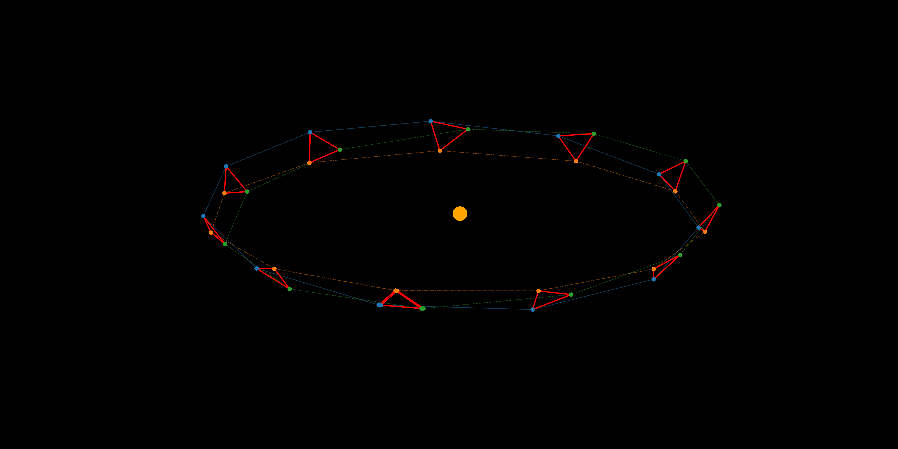

# ResponseRequirements

## Overview

This repository contains computational tools for quantifying **uncertainties and mismodeling** in the gravitational wave response of the **Laser Interferometer Space Antenna (LISA)**—a space-based gravitational wave observatory planned for the mid-2030s.

### Key Research Questions

1. **Orbit Uncertainties**: How do uncertainties in spacecraft positions and velocities (determined via ground-based radiometric tracking) propagate into the gravitational wave response?

2. **Response Mismodeling**: What is the impact of neglecting spacecraft velocity-dependent terms in the response kernel on parameter estimation and source localization?

### Main Contributions

- Comprehensive waveform **mismatch analysis** across frequency, sky position, and polarization
- Comparison of **static toy constellation** models with realistic **evolving orbits** from mission-representative orbit-determination simulations
- Validation using **galactic binary inference** to quantify parameter bias and localization errors
- High-performance implementations in JAX for fast response calculations

The code leverages ESA's **GODOT** astrodynamics library and **MIDAS** orbit-determination package to generate realistic spacecraft trajectories, then evaluates mismatches between responses computed with nominal and perturbed orbital parameters.



## Key Findings

- **Orbit uncertainties** produce negligible mismatches across the LISA band, with effects dominated at higher frequencies (∝ f²)
- **Velocity mismodeling** (neglecting v/c terms) has larger impact at low frequencies (∝ f⁻²), reaching ~10⁻³ mismatch at 0.1 mHz
- MCMC analysis shows mild parameter biases (~0.6σ) when using velocity-neglecting templates on high-SNR galactic binary signals

## Installation
Follow these steps to set up the project on your local machine:


1. **Clone the repository**:
    ```bash
    git clone https://github.com/lorenzsp/ResponseRequirements.git
    cd ResponseRequirements
    ```

2. **Install dependencies**:
    Ensure you have conda installed. Then run:
    ```bash
    conda create -n lisa_resp -c conda-forge gcc_linux-64 gxx_linux-64 python=3.12
    conda activate lisa_resp
    pip install lisaorbits healpy pytdi tqdm numpy Cython scipy jupyter ipython h5py matplotlib tqdm
    ```

## Usage

The main analysis workflow is orchestrated by:

```bash
bash run_segwo_analysis.sh
```

This script runs:
- **Orbit perturbation analysis** (static toy model)
- **Orbit-determination simulation** (realistic evolving orbits)
- **Mismatch computation** across frequency and sky
- **Figure generation** for publication

### Key Scripts

- `gb_bias_analysis.py` — Differential evolution optimization to study parameter bias under model mismatch
- `gb_fit.py` — MCMC inference comparing relativistic vs. non-relativistic response templates
- `test_nonrel_models.py` — Validation of differences between old and new response models
- `PaperPlots.ipynb` — Publication-quality figure generation from pre-computed results


## Citation

If you use this code or data in your research, please cite the following paper:

**BibTeX entry:**
```bibtex
@article{Speri2026,
  author = {Speri, Lorenzo and Hartwig, Olaf and Martens, Waldemar and Jennrich, Oliver and Joffre, Eric and Armano, Michele and Hewitson, Martin and L\"utzgendorf, Nora},
  title = {Uncertainties and mismodeling of the gravitational wave response of the {L}aser {I}nterferometer {S}pace {A}ntenna},
  journal = {},
  year = {2026},
  note = {In preparation},
  url = {https://github.com/lorenzsp/ResponseRequirements}
}
```

## Contact
For questions or feedback, please contact [Lorenzo Speri](https://github.com/lorenzsp).