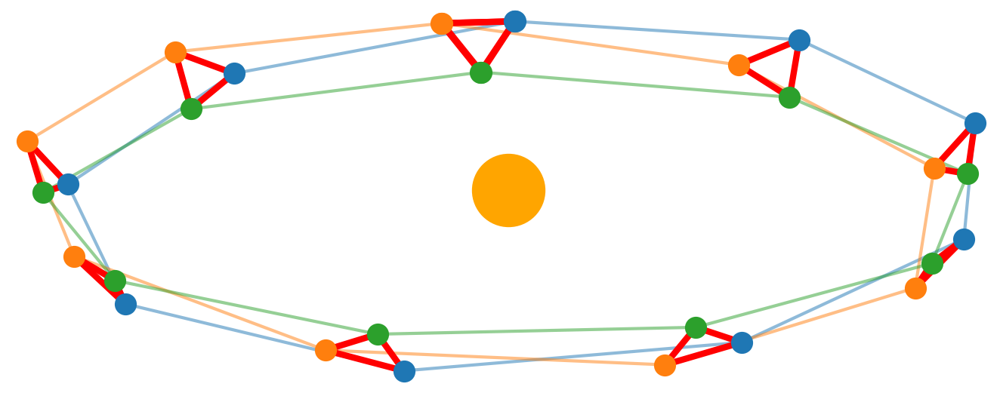

# ResponseRequirements



## Overview

This repository contains computational tools for quantifying **uncertainties and mismodeling** in the gravitational wave response of the **Laser Interferometer Space Antenna (LISA)**—a space-based gravitational wave observatory planned for the mid-2030s. If you use this code or data in your research, please cite the [accompanying paper](#citation).

### Key Research Questions

1. **Orbit Uncertainties**: How do uncertainties in spacecraft positions and velocities (determined via ground-based radiometric tracking) propagate into the gravitational wave response?

2. **Response Mismodeling**: What is the impact of neglecting spacecraft velocity-dependent terms in the response kernel on parameter estimation and source localization? Check out [the paper deriving the boosted response](https://arxiv.org/pdf/2509.10038) for the details.


## Installation
Follow these steps to set up the project on your local machine:


1. **Clone the repository**:
    ```bash
    git clone https://github.com/lorenzsp/ResponseRequirements.git
    cd ResponseRequirements
    ```

2. **Install dependencies**:
    Ensure you have conda installed. Then run:
    ```bash
    conda create -n lisa_resp -c conda-forge gcc_linux-64 gxx_linux-64 python=3.12
    conda activate lisa_resp
    pip install lisaorbits lisaconstants pytdi tqdm numpy Cython scipy jupyter ipython h5py matplotlib tqdm healpy corner eryn
    ```

## Running Analysis

The run the analysis workflow for the response-only model use:

```bash
bash run_segwo_analysis.sh
```

This script runs:
- **Orbit perturbation analysis** (static toy model)
- **Orbit-determination simulation** (realistic evolving orbits)
- **Mismatch computation** across frequency and sky

The run the analysis workflow for the galactic binary response model use:

- `gb_bias_analysis.py` — Differential evolution optimization to study parameter bias under model mismatch
- `gb_fit.py` — MCMC inference comparing relativistic vs. non-relativistic response templates
- `test_nonrel_models.py` — Validation of differences between old and new response models
- `PaperPlots.ipynb` — Publication figure generation once the results are generated

## Reproducing Publication Figures

### Script-based workflow (recommended)

The `reproduce_plots/` folder contains one self-contained Python script per
figure. Each script reads only lightweight HDF5 files and writes its output
to `reproduce_plots/figures/`.

**Reproduce all figures in one go:**

```bash
bash reproduce_plots/run_all.sh
```

Or reproduce a single figure independently:

```bash
python reproduce_plots/plot_07_mismatch_vs_frequency.py
```

## Citation

If you use this code or data in your research, please cite the following paper:

**BibTeX entry:**
```bibtex
@article{Speri2026,
  author = {Speri, Lorenzo and Hartwig, Olaf and Martens, Waldemar and Jennrich, Oliver and Joffre, Eric and Armano, Michele and Hewitson, Martin and L\"utzgendorf, Nora},
  title = {Impact of uncertainties and mismodeling of the gravitational wave response on the Laser Interferometer Space Antenna Science},
  journal = {},
  year = {2026},
  note = {In preparation},
  url = {https://github.com/lorenzsp/ResponseRequirements}
}
```

## Contact
For questions or feedback, please contact [Lorenzo Speri](https://github.com/lorenzsp).